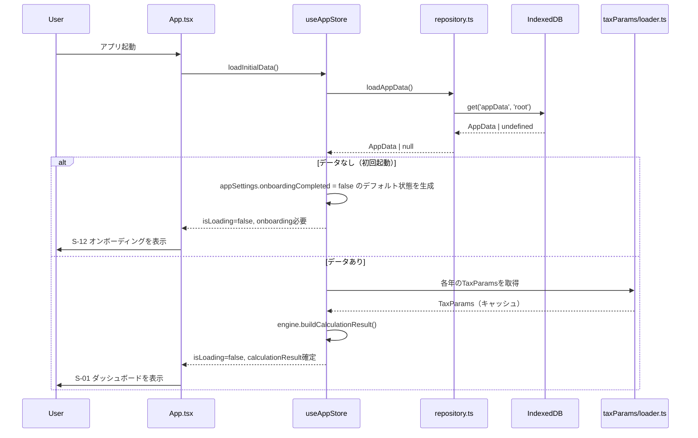
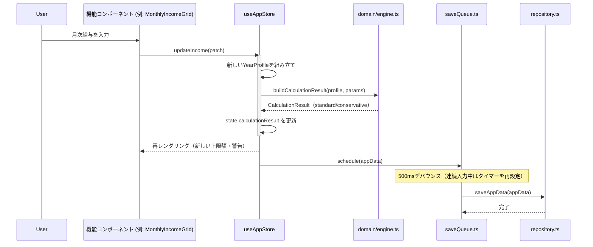
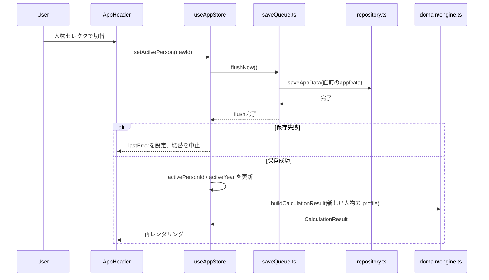
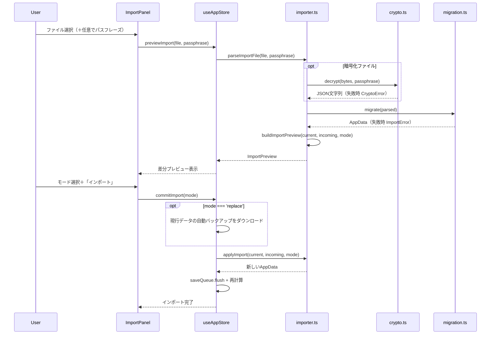
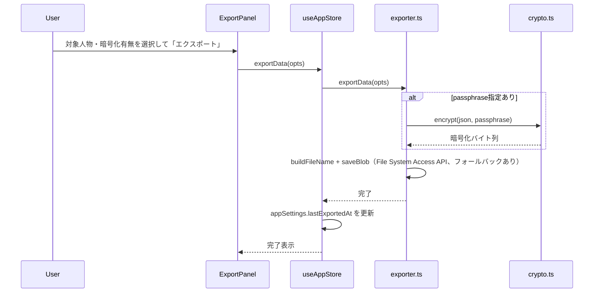
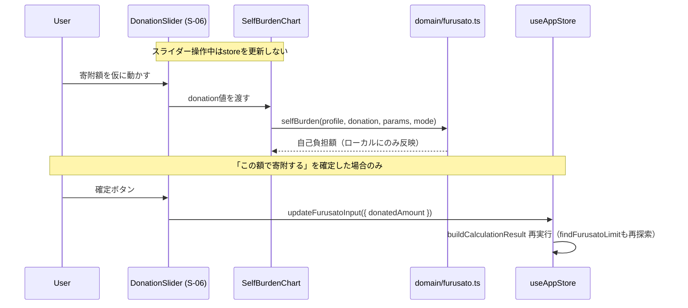

# 詳細設計書
## 個人税額・ふるさと納税上限シミュレータ（TaxSim）

| 項目 | 内容 |
|---|---|
| 文書バージョン | 1.0 |
| 作成日 | 2026-07-26 |
| 関連文書 | 01_要件定義書_税額シミュレータ.md、02_仕様書_税額シミュレータ.md |
| 位置づけ | 内部設計書。実装者がそのまま着手できる粒度（関数インターフェース・状態管理プロトコル・永続化物理設計・コンポーネント分割・処理シーケンス・エラーハンドリング・テストケース）を定める |
| 対象範囲 | 要件定義書のFR-01〜FR-31すべてを同じ深さで扱う（フェーズによる濃淡は付けない） |

---

## 0. 目次

1. 本書の位置づけと読み方
2. モジュール構成
3. ドメイン層 詳細設計
4. 状態管理（Zustand）詳細設計
5. 永続化層 詳細設計
6. UIコンポーネント設計
7. 処理シーケンス
8. エラーハンドリング・例外設計
9. バリデーション詳細
10. 詳細テストケース
11. FR／画面トレーサビリティ表
12. 未決事項・詳細設計時点でのリスク

---

## 1. 本書の位置づけと読み方

### 1.1 文書の関係

```
01_要件定義書   … 何を解決するか（背景・機能要件・非機能要件・受け入れ基準）
02_仕様書       … どう作るか（外部設計: アーキテクチャ・データモデル・画面ワイヤーフレーム・税制パラメータ・計算方式）
03_詳細設計書   … 実装者が着手できる粒度に落とす（内部設計: 関数I/F・状態遷移・物理スキーマ・コンポーネント分割）
```

本書は02仕様書の内容を前提とし、矛盾する場合は02仕様書を正とする。02仕様書で定義済みの型（`AppData` `Person` `YearProfile` `IncomeInput` `DeductionInput` `HousingLoanInput` `FurusatoInput` `MunicipalityConfig` `CalculationResult`）はすべて継承し、本書では必要な箇所のみ拡張・参照する。

### 1.2 記法

- 金額型`Yen`、端数処理関数`floorTo` `floor1000` `floor100` `floorYen`は02仕様書§1.3のものをそのまま`domain/types.ts`に置く。
- 関数仕様は「シグネチャ／処理ステップ／エッジケース／対応する仕様書箇所」の順で記述する。処理ステップは疑似コードではなく箇条書きの手順とし、実装コードそのものは書かない（本書はコード生成物ではなく設計文書のため）。
- FR-xx・S-xx・W-xx・T-xx・D-xxのIDは01要件定義書・02仕様書のものをそのまま踏襲する。
- 本書中の金額の数値例（モデルケースM1など）はすべて説明のための仮の数値であり、実在の個人の所得情報ではない。

### 1.3 対象範囲についての方針

要件定義書のFR-01〜FR-31は、実装順序（要件定義書§10のPhase 0〜3）に関わらず、本書では同じ深さで扱う。Phase 3相当の機能（FR-21 寄附実績記録、FR-22 複数年最適化など）についても、関数インターフェースとデータ型は確定させる。ただし実装ロードマップ自体は02仕様書§8のPhase構成を変更しない。

---

## 2. モジュール構成

### 2.1 ディレクトリ構成（02仕様書§1.4.1の`src/`を詳細化）

```
src/
├── domain/
│   ├── types.ts            Yen型・floor関数・TraceStep・共通の型ユーティリティ
│   ├── income.ts            給与収入の集計・月次按分・見込み推定
│   ├── deductions.ts        所得控除（寄附金控除を除く）
│   ├── incomeTax.ts         所得税額の算出（累進税率・復興特別所得税）
│   ├── residentTax.ts       住民税額の算出（調整控除・寄附金税額控除・均等割）
│   ├── housingLoan.ts       住宅ローン控除の所得税／住民税への振り分け
│   ├── furusato.ts          差分シミュレーション・二分探索による上限額算出
│   ├── warnings.ts          W-01〜W-08の警告判定
│   ├── engine.ts            上記モジュールを束ねるオーケストレータ（旧calcTaxes）
│   ├── actuals.ts           検算モード（FR-17）の実績値比較
│   └── scenario.ts          シナリオ比較（FR-16）・複数年最適化（FR-22）
├── taxParams/
│   ├── schema.ts            TaxParams型定義
│   ├── loader.ts            fetchとバージョン検証（R-01対応）
│   └── defaults.ts          読み込み失敗時のフォールバック方針（§8参照）
├── persistence/
│   ├── db.ts                idbラッパーの初期化（DB名・version）
│   ├── repository.ts        AppDataのCRUD（loadAppData/saveAppData/clearAppData）
│   ├── migration.ts         schemaVersion移行
│   ├── exporter.ts          エクスポート（ファイル名生成・保存）
│   ├── importer.ts          インポート（差分プレビュー生成・3モード適用）
│   ├── crypto.ts            AES-GCM + PBKDF2 暗号化・復号
│   └── settings.ts          localStorage（UI状態のみ）
├── store/
│   ├── useAppStore.ts        Zustandストア本体
│   ├── selectors.ts          派生セレクタ（世帯合計・配偶者所得参照など）
│   └── saveQueue.ts          デバウンス保存の直列化キュー
├── ui/
│   ├── layout/               AppHeader・DisclaimerFooterなど共通レイアウト
│   ├── screens/              S-01〜S-12の画面コンテナ（Tier1）
│   ├── features/              画面固有の機能コンポーネント（Tier2）
│   └── primitives/            汎用UI部品（Tier3）
├── App.tsx                   画面状態（タブ切替）の管理とレイアウト合成
└── main.tsx                   エントリポイント、Service Worker登録
```

### 2.2 各層の責務（再掲・詳細化）

| 層 | 責務 | 副作用 |
|---|---|---|
| domain/ | 税額計算そのもの。`YearProfile`＋`TaxParams`を入力に`CalculationResult`を返す | なし（純粋関数のみ） |
| taxParams/ | 年分パラメータJSONの取得・検証・キャッシュ | fetch（読み取りのみ） |
| persistence/ | IndexedDB・localStorageへの読み書き、エクスポート／インポート、暗号化 | あり（ストレージI/O） |
| store/ | UI状態とドメイン層・永続化層の橋渡し。人物・年度の切替、再計算と保存のタイミング制御 | あり（store経由での副作用の起点） |
| ui/ | 表示とユーザー操作の受付のみ。ドメインロジックを持たない | あり（DOM） |

---

## 3. ドメイン層 詳細設計

### 3.1 `domain/types.ts`

```ts
type Yen = number & { readonly __brand: 'Yen' };

function floorTo(v: number, unit: number): number;      // Math.floor(v / unit) * unit
function floor1000(v: number): Yen;                     // 課税所得の端数処理
function floor100(v: number): Yen;                      // 税額の端数処理
function floorYen(v: number): Yen;                      // 円未満切り捨て
function asYen(v: number): Yen;                          // 整数・非負であることを検証してブランド付与。違反時はValidationErrorを投げる

interface TraceStep {
  key: string;            // 例: 'salaryDeduction'（画面S-05での参照キー）
  label: string;          // 例: '給与所得控除'
  value: number;
  formula?: string;       // 例: '収入 × 20% + 440,000'
  refs?: string[];        // 例: ['02仕様書§3.2.1']
}

type FurusatoCapMode = 'standard' | 'conservative';   // AppSettings.furusatoCapModeと同じ型を再利用
```

`asYen`は境界（フォーム入力からドメイン層に渡す箇所）でのみ呼び、ドメイン層内部の計算結果は既に`Yen`型として扱ってよい（内部関数間で毎回検証すると計算コストが二重になるため）。

### 3.2 `domain/income.ts`

給与収入の集計と月次按分（FR-02〜FR-04）を担当する。

| 関数 | シグネチャ | 処理内容 |
|---|---|---|
| `applyLeavePeriods` | `(income: IncomeInput, year: number) => IncomeInput` | `leavePeriods`の各期間を月に展開し、対象月の`grossSalary`/`socialInsurance`を0、`isSocialInsuranceExempt`をtrueにした**新しい**`IncomeInput`を返す（疑似コードは破壊的更新だが、純粋関数化のため`monthly`配列を都度複製する）。賞与についても`isBonusExempt`の結果を反映した新配列を返す |
| `isBonusExempt` | `(bonus: Bonus, leaves: LeavePeriod[]) => boolean` | 賞与の算定対象期間（`bonus.month`の前月からの一定期間、というルールは02仕様書§4.4の「1ヶ月超の育休期間に月末をまたぐ場合」を踏襲）に育休月が含まれるかを判定 |
| `sumMonthlySalary` | `(income: IncomeInput) => Yen` | `monthly[]`の`grossSalary`合計 |
| `sumMonthlySocialInsurance` | `(income: IncomeInput) => Yen` | `monthly[]`の`socialInsurance`合計 |
| `sumBonuses` | `(income: IncomeInput) => Yen` | `bonuses[]`の`gross`合計 |
| `sumBonusSocialInsurance` | `(income: IncomeInput) => Yen` | `bonuses[]`の`socialInsurance`合計 |
| `calcGrossIncome` | `(income: IncomeInput) => Yen` | 月次給与＋賞与＋`otherSalaryIncome`の合計 |
| `calcSalaryDeduction` | `(gross: Yen, table: SalaryDeductionTable) => Yen` | 02仕様書§3.2.1の表を`max(表引き, 最低保障額)`で適用 |
| `calcSalaryIncome` | `(gross: Yen, table: SalaryDeductionTable) => Yen` | `max(0, gross - calcSalaryDeduction(gross, table))` |
| `sumNonTaxableBenefits` | `(income: IncomeInput) => Yen` | `leavePeriods[].benefitAmount`の合計（FR-04。課税計算には使わず表示専用） |
| `estimateAnnualIncome` | `(income: IncomeInput, params: EstimationParams) => IncomeEstimate` | FR-03。`status: 'actual'`の月数から`confidenceRatio`（実績月数/12）を算出し、`status: 'estimated'`の月を直近実績月の値で埋めた`IncomeInput`と`confidenceRatio`を返す |

```ts
interface EstimationParams {
  fillMode: 'lastActual' | 'average' | 'manual';
}
interface IncomeEstimate {
  filledIncome: IncomeInput;
  confidenceRatio: number;     // W-06の判定に使う（<0.5で警告）
}
```

エッジケース: `leavePeriods`が年をまたぐ場合（例: 2025年7月〜2026年1月）、`applyLeavePeriods`は`year`引数で対象年分の月のみを切り出す。年またぎの育休全体像はYearProfileの前後年を突き合わせて表示する責務をUI層（S-02）に持たせ、ドメイン層は単年のみを扱う。

### 3.3 `domain/deductions.ts`

所得税・住民税で共通する控除ロジックは、テーブル（上限額の構成）を引数化して1関数を両税目で共用する。

| 関数 | シグネチャ | 処理内容 |
|---|---|---|
| `lookupBasicDeduction` | `(totalIncome: Yen, table: BasicDeductionTable) => Yen` | 02仕様書§3.2.2の表引き（所得税用テーブルと住民税用テーブルは別の`table`を渡す） |
| `calcLifeInsuranceDeduction` | `(input: LifeInsuranceInput, table: LifeInsuranceTable) => Yen` | 新・旧それぞれの区分ごとに02仕様書§3.2.4の式を適用し、`max(新のみ, 旧のみ, min(新+旧, 新制度区分上限))`を区分ごとに計算して合算。`hasChildUnder23`による上限拡充（令和8年分・所得税のみ）は`table`側のフラグで表現する |
| `calcEarthquakeInsuranceDeduction` | `(input: { long: number; short: number }, table) => Yen` | 長期・短期の控除額を合算（上限あり） |
| `calcMedicalDeduction` | `(input: MedicalInput, totalIncome: Yen, params) => MedicalDeductionResult` | 下記参照 |
| `calcSpouseDeduction` | `(input: SpouseInput, taxpayerTotalIncome: Yen, table) => Yen` | 配偶者の合計所得金額と納税者本人の合計所得金額から配偶者控除／配偶者特別控除を判定（段階的逓減を含む） |
| `calcDependentDeduction` | `(dependents: Dependent[], table) => Yen` | 一般／特定扶養の区分ごとに合算 |
| `calcDisabilityDeduction` | `(inputs: DisabilityInput[], table) => Yen` | 区分（一般・特別・同居特別）ごとの控除額を合算 |
| `calcSingleParentDeduction` | `(isSingleParent: boolean, table) => Yen` | 該当時のみ固定額 |
| `calcIncomeTaxDeductionBreakdown` | `(profile: YearProfile, totalIncome: Yen, params: TaxParams) => DeductionBreakdown` | 上記を束ね、寄附金控除を除いた所得税側の所得控除合計を返す集約関数 |
| `calcResidentTaxDeductionBreakdown` | `(profile: YearProfile, totalIncome: Yen, params: TaxParams) => DeductionBreakdown` | 住民税側の集約関数。基礎控除は住民税専用テーブル（430,000円・逓減あり）を使用し、寄附金は含まない（住民税では税額控除のため） |

```ts
interface MedicalDeductionResult {
  amount: Yen;
  thresholdUsed: Yen;                                 // min(100,000, 総所得×5%)の実際に使われた値
  thresholdBasis: 'fixed100000' | 'incomeRatio5pct';   // FR-06「足切り額の切替を明示」用
  selfMedicationAmount: Yen;                           // セルフメディケーション税制で計算した場合の額
  chosenMode: 'medical' | 'selfMedication';            // mode:'auto'のときの有利判定結果
}
```

`calcMedicalDeduction`の処理ステップ:
1. 足切り額 = `min(100000, totalIncome * 0.05)` を計算し、`thresholdBasis`を判定する。
2. 医療費控除額(候補) = `min(max(0, paid - reimbursed - 足切り額), 2000000)`。
3. セルフメディケーション控除額(候補) = `min(max(0, selfMedication - 12000), 88000)`。
4. `mode === 'auto'`なら2と3の大きい方を採用し`chosenMode`に記録。`mode`が明示指定ならその方式のみ採用（両立不可のため、明示時はもう一方を0とする）。
5. `reimbursed > paid`はここでは扱わず、入力段階のバリデーション（§9）でエラーにする。

### 3.4 `domain/incomeTax.ts`

| 関数 | シグネチャ | 処理内容 |
|---|---|---|
| `calcTaxableIncome` | `(totalIncome: Yen, deductionTotal: Yen) => Yen` | `floor1000(max(0, totalIncome - deductionTotal))` |
| `lookupTaxRate` | `(taxable: Yen, brackets: TaxBracket[]) => { rate: number; offset: Yen }` | 02仕様書§3.2.3の表引き |
| `calcCalculatedTax` | `(taxable: Yen, rate: number, offset: Yen) => Yen` | `max(0, taxable * rate - offset)` |
| `calcReconstructionTax` | `(taxAfterCredits: Yen) => Yen` | `floor100(taxAfterCredits * 0.021)` |
| `calcIncomeTaxTotal` | `(taxAfterCredits: Yen, reconstruction: Yen) => Yen` | 単純合算 |

### 3.5 `domain/housingLoan.ts`

住宅ローン控除の所得税→住民税への振り分けと切り捨て損失の算出（FR-07、本アプリの警告エンジンの核）。

| 関数 | シグネチャ | 処理内容 |
|---|---|---|
| `calcCreditAvailable` | `(input: HousingLoanInput) => Yen` | `floorYen(min(yearEndBalance, borrowingCap) * rate)` |
| `applyToIncomeTax` | `(available: Yen, calculatedTax: Yen) => { used: Yen; carried: Yen }` | `used = min(available, calculatedTax)`、`carried = available - used` |
| `calcResidentTaxCap` | `(taxableResident: Yen, rule: 'rule5pct97500' \| 'rule7pct136500') => Yen` | ruleに応じ`min(taxableResident * 0.05, 97500)`または`min(taxableResident * 0.07, 136500)` |
| `applyToResidentTax` | `(carried: Yen, cap: Yen, availableLevy: Yen) => { used: Yen; wasted: Yen }` | `used = min(carried, cap, availableLevy)`、`wasted = carried - used` |

`availableLevy`には「調整控除後・寄附金税額控除を先に適用した後の所得割額」を渡す（02仕様書§3.3.2の適用順序: 調整控除→寄附金税額控除→住宅ローン控除）。`wasted`がT-06・W-02の判定対象、寄附あり／なしでの`wasted`の差がT-07・W-03の判定対象になる。

### 3.6 `domain/residentTax.ts`

| 関数 | シグネチャ | 処理内容 |
|---|---|---|
| `calcHumanDeductionDiff` | `(profile: YearProfile, params: TaxParams) => Yen` | 人的控除（基礎控除・配偶者控除・扶養控除など）ごとの所得税/住民税の差額を合算した`D`。基礎控除差は02仕様書§3.3.1の注記どおり**5万円固定**として扱う（所得税側の基礎控除額改正に連動させない） |
| `calcAdjustmentCredit` | `(taxableResident: Yen, D: Yen) => Yen` | 02仕様書§3.3.1の分岐式（≦200万／>200万、最低2,500円） |
| `calcIncomeLevyBeforeAdjustment` | `(taxableResident: Yen, municipalRate: number, prefecturalRate: number) => Yen` | `taxableResident * (municipalRate + prefecturalRate)` |
| `calcIncomeLevy` | `(before: Yen, adjustment: Yen) => Yen` | `max(0, before - adjustment)`。住民税の所得割額（自治体の実効税率ベース）。★特例分20%枠の基準にはこれとは別に、標準税率10%で算出し直した額を用いる（下記） |
| `calcFurusatoBasicCredit` | `(donation: Yen, totalIncome: Yen) => Yen` | `target = min(donation, totalIncome*0.3)`、`max(0, target-2000)*0.10` |
| `calcFurusatoSpecialCredit` | `(donation: Yen, totalIncome: Yen, marginalRate: number, incomeLevy: Yen) => { raw: Yen; capped: Yen; capReached: boolean }` | `raw = max(0, target-2000)*(0.90 - marginalRate*1.021)`、`capValue = incomeLevy*0.20`、`capped = min(raw, capValue)`、`capReached = raw > capValue` |
| `calcPerCapitaLevy` | `(config: MunicipalityConfig) => Yen` | 均等割（市町村＋道府県）＋森林環境税の合算 |
| `calcIncomeLevyFinal` | `(afterFurusato: Yen, hlInResident: Yen) => Yen` | `floor100(max(0, afterFurusato - hlInResident))` |

特例分20%枠の基準（02仕様書§2.2）は、`MunicipalityConfig.useStandardRateForFurusato`が`true`（既定）のとき、`calcIncomeLevyBeforeAdjustment`に`residentTax.municipalIncomeRateStandard`(0.06)・`prefecturalIncomeRateStandard`(0.04)を渡して算出した額から調整控除を引いた値を用いる。超過課税分は枠の判定に含めない。住民税額そのもの（`incomeLevy` / `incomeLevyFinal` / 住民税合計）は引き続き自治体の実効税率で計算するため、`engine.ts`は両者を別々に保持し、`CalculationResult.residentTax`に`incomeLevy`と`incomeLevyForFurusatoCap`の両方を出力する。`false`のときは両者が一致する。

`conservative`モード（02仕様書§4.3）では`calcIncomeLevy`の呼び出し元（`engine.ts`）が、住宅ローン控除適用後の所得割額を別途算出し、`calcFurusatoSpecialCredit`の`incomeLevy`引数にどちらを渡すかを`mode`パラメータで切り替える。ドメイン関数自体は「渡された基準額に対して20%を掛ける」だけを行い、どちらの基準を使うかの判断はオーケストレータ（`engine.ts`）の責務とする。

### 3.7 `domain/furusato.ts`

差分シミュレーション方式の中核（要件定義書§1.3・02仕様書§4.1）。この関数群は`engine.calcSnapshot`にのみ依存し、税目ごとの計算式には一切依存しない。

| 関数 | シグネチャ | 処理内容 |
|---|---|---|
| `selfBurden` | `(profile: YearProfile, donation: Yen, params: TaxParams, mode: FurusatoCapMode) => Yen` | `engine.calcSnapshot(profile, 0, params, mode)`と`engine.calcSnapshot(profile, donation, params, mode)`を呼び、02仕様書§4.2の式で自己負担額を計算 |
| `findFurusatoLimit` | `(profile: YearProfile, params: TaxParams, mode: FurusatoCapMode) => FurusatoLimitResult` | 1,000円刻みの二分探索（下記手順）＋単調性ガード |

```ts
interface FurusatoLimitResult {
  limit: Yen;                 // 上限額
  recommended: Yen;           // limit * safetyRatio（1,000円未満切り捨て）
  approxByFormula: Yen;       // 参考値（02仕様書§5.3の近似式）
  snapshotAtZero: TaxSnapshot;
  snapshotAtLimit: TaxSnapshot;
}
```

`findFurusatoLimit`の処理ステップ（02仕様書§4.2の疑似コードを手順化）:
1. `snapshotAtZero.residentTax.incomeLevy === 0`（所得割非課税）なら`limit = 0`で早期リターンする。差分方式の式をそのまま適用すると、寄附額2,000円以下では税額控除が一切発生しなくても自己負担がちょうど2,000円以下になるという自明な帰結だけから`limit`が見かけ上2,000円と算出されてしまう（便益ゼロの寄附を「上限」と呼ぶのは利用者に誤解を与える）。この特別扱いはW-05と対応する。
2. `selfBurden(profile, 1000, params, mode) > 2000`なら`limit = 0`で早期リターン（その他、ごく低所得のケース）。
3. `lo=0, hi=2_000_000`から開始し、`hi-lo>1000`の間、中間値`mid`（1,000円単位に切り捨て）で`selfBurden`を評価し、`≤2000`なら`lo=mid`、そうでなければ`hi=mid`。
4. 収束後、`lo`から`lo+5000`まで1,000円刻みで線形に再検証し、`selfBurden≤2000`を満たす最大値まで`lo`を前進させる（単調性が理論上成立していても、境界での実装ミスを検出するガード）。
5. `recommended = floorTo(limit * profile.furusato.safetyRatio, 1000)`。
6. `approxByFormula`は`snapshotAtZero.incomeLevyBase * 0.20 / (0.90 - marginalRate*1.021) + 2000`（参考表示専用、上限の確定には使わない）。

計算コストの見積り: 二分探索は`log2(2_000_000/1000)≈11`回、線形ガードで最大5回、モード2種（standard/conservative）を両方保持するため合計約32回の`calcSnapshot`呼び出しが1回の「上限額算出」で発生する。1回の`calcSnapshot`は単純な四則演算のみで、NFR-07（100ms以内）を満たすことは十分な余裕がある（実測はPhase1のT-15/T-17実装時に確認する）。

### 3.8 `domain/warnings.ts`

W-01〜W-08（要件定義書§6.2）を1条件1関数で実装し、`Warning`の文言はUI層で解決するため`messageKey`のみ持たせる（i18n・文言変更の影響をドメイン層から切り離すため）。

```ts
interface Warning {
  id: 'W-01' | 'W-02' | 'W-03' | 'W-04' | 'W-05' | 'W-06' | 'W-07' | 'W-08';
  severity: 'info' | 'caution' | 'critical';
  messageKey: string;
  params?: Record<string, number | string>;   // メッセージ内に埋め込む値（例: 切り捨て損失額）
}

interface WarningContext {
  snapshotAtZero: TaxSnapshot;
  snapshotAtDonated: TaxSnapshot;      // furusato.donatedAmount適用時
  limitResult: FurusatoLimitResult;
  profile: YearProfile;
  incomeEstimate: IncomeEstimate;
  taxParamsVerifiedAt: string;
}
```

| 関数 | 判定内容 |
|---|---|
| `checkW01` | `snapshotAtZero.incomeTax.taxAfterCredits === 0` |
| `checkW02` | `snapshotAtZero.housingLoan.wasted > 0` |
| `checkW03` | `snapshotAtDonated.housingLoan.wasted > snapshotAtZero.housingLoan.wasted` |
| `checkW04` | `profile.deductions.medical.paid > 0 && profile.furusato.method === 'oneStop'`（本来はバリデーションでoneStop選択不可にするため、ここに到達する場合はデータ不整合の検知として扱う） |
| `checkW05` | `snapshotAtZero.residentTax.incomeLevy === 0` |
| `checkW06` | `incomeEstimate.confidenceRatio < 0.5` |
| `checkW07` | `snapshotAtDonated.furusato.specialCapReached === true`（探索で求めた理論上の上限ではなく、利用者が実際に入力した寄附額での到達状況を見る） |
| `checkW08` | `profile.housingLoan !== undefined`（年末調整で住宅ローン控除を受けている前提を入力の有無から推定。将来的に「年末調整で申告済みか」の入力項目を追加する余地はFR-07拡張として§12に記載） |
| `runAllWarningChecks` | `(ctx: WarningContext) => Warning[]`。上記8関数を順に評価し、`Warning | null`のうち非nullのみ配列にまとめる |

### 3.9 `domain/engine.ts`（オーケストレータ）

02仕様書§4.2の`calcTaxes`に相当する。個々の計算モジュールを呼び出し順に組み合わせ、`TraceStep[]`を構築しながら結果を返す。

| 関数 | シグネチャ | 概要 |
|---|---|---|
| `calcSnapshot` | `(profile: YearProfile, donation: Yen, params: TaxParams, mode: FurusatoCapMode) => TaxSnapshot` | 単一ケース（寄附額Dを固定）の税額計算。3.2〜3.6の関数を順に呼び出す |
| `buildCalculationResult` | `(profile: YearProfile, params: TaxParams) => CalculationResult` | `findFurusatoLimit`を`standard`・`conservative`両方で呼び、`furusato.donatedAmount`時点の`calcSnapshot`、`warnings.runAllWarningChecks`を組み合わせて02仕様書§2.3の`CalculationResult`を組み立てる |

`calcSnapshot`の処理順序（02仕様書§4.2の順序を踏襲、各ステップでTraceStepを1件push）:

1. `income.applyLeavePeriods` → `income.calcGrossIncome` → `income.calcSalaryDeduction` → `income.calcSalaryIncome`（合計所得金額 = 給与所得。給与以外の所得は非対象のため他の所得区分は無し）
2. `deductions.calcIncomeTaxDeductionBreakdown`（寄附金控除は`donation`引数から別途加算）
3. `incomeTax.calcTaxableIncome` → `incomeTax.lookupTaxRate` → `incomeTax.calcCalculatedTax`
4. `housingLoan.calcCreditAvailable` → `housingLoan.applyToIncomeTax`
5. `incomeTax.calcReconstructionTax` → `incomeTax.calcIncomeTaxTotal`
6. `deductions.calcResidentTaxDeductionBreakdown`
7. `incomeTax.calcTaxableIncome`相当（住民税用、同名関数を住民税テーブルで再利用）
8. `residentTax.calcHumanDeductionDiff` → `residentTax.calcAdjustmentCredit` → `residentTax.calcIncomeLevyBeforeAdjustment` → `residentTax.calcIncomeLevy`
9. `residentTax.calcFurusatoBasicCredit` → `residentTax.calcFurusatoSpecialCredit`
10. `housingLoan.calcResidentTaxCap` → `housingLoan.applyToResidentTax`（`mode==='conservative'`の場合は住宅ローン控除適用後の所得割額を先に別途計算し、手順9のspecialCapに使う基準を差し替える）
11. `residentTax.calcIncomeLevyFinal` → `residentTax.calcPerCapitaLevy`
12. 上記を`TaxSnapshot`にまとめて返す

```ts
interface TaxSnapshot {
  income: CalculationResult['income'];
  incomeTax: CalculationResult['incomeTax'];
  residentTax: CalculationResult['residentTax'];
  housingLoan: CalculationResult['housingLoan'];
  marginalRate: number;
  furusato: { basicCredit: Yen; specialCredit: Yen; specialCapReached: boolean };
  trace: TraceStep[];
}
```

`buildCalculationResult`は`CalculationResult`（02仕様書§2.3）を構築する最終工程で、`furusato.limitAmount`/`recommendedAmount`/`approxByFormula`/`breakdown`/`specialCapReached`は`findFurusatoLimit('standard')`の結果から埋め、`conservative`モードの結果は`CalculationResult`に追加フィールド`furusatoConservative`（`standard`と同型）として持たせ、S-05で両方を並記できるようにする。

### 3.10 `domain/actuals.ts`（FR-17 検算モード）

```ts
interface ActualValues {
  source: 'withholding' | 'residentTaxNotice' | 'taxReturn';
  incomeTaxTotal?: Yen;
  residentIncomeLevy?: Yen;
  residentPerCapita?: Yen;
  housingLoanUsedIncomeTax?: Yen;
  housingLoanUsedResident?: Yen;
  note?: string;
}

interface ActualComparisonItem {
  label: string;
  calculated: Yen;
  actual: Yen;
  diffAbs: Yen;
  diffPct: number;
}

function compareWithActuals(
  result: CalculationResult,
  actuals: ActualValues
): { items: ActualComparisonItem[]; withinTolerance: boolean };  // withinTolerance = 全項目の|diffPct| <= 1%
```

`withinTolerance`がfalseの場合、要件定義書G2・02仕様書§7.3の運用ルール（T-17に通るまで出力を意思決定に使わない）に従い、S-01ダッシュボードに恒常的な注意表示を出す（実装詳細は§9のバリデーション/警告表とは別枠の「検算未達バナー」として扱う）。

### 3.11 `domain/scenario.ts`（FR-16 シナリオ比較、FR-22 複数年最適化）

```ts
interface ScenarioOverride {
  label: string;
  reinstatementMonth?: number;          // 復職月を変更
  bonusMultiplier?: number;             // 賞与額の倍率（査定期間の育休による減額を模擬）
  additionalMedicalExpense?: Yen;
  donationAmountOverride?: Yen;
}

function applyScenarioOverride(base: YearProfile, override: ScenarioOverride): YearProfile;
function runScenario(base: YearProfile, override: ScenarioOverride, params: TaxParams): CalculationResult;
function compareScenarios(
  baseResult: CalculationResult,
  variants: { override: ScenarioOverride; result: CalculationResult }[]
): { label: string; limitAmount: Yen; diffFromBase: Yen }[];
```

複数年最適化（FR-22、要件定義書優先度Could）は関数インターフェースのみ確定させ、実装はPhase 3とする。

```ts
interface MultiYearAllocationInput {
  profiles: YearProfile[];             // 対象年（2件、例: 今年・来年）
  paramsByYear: Record<number, TaxParams>;
}
interface MultiYearAllocation {
  years: number[];
  perYearLimit: Yen[];
  suggestedDonation: Yen[];             // 各年に配分する推奨寄附額（合計は世帯上限の合計を超えない）
  rationale: string;                    // 配分根拠の説明文（例: 育休で所得割額が低い年は圧縮する）
}
function optimizeAcrossYears(input: MultiYearAllocationInput): MultiYearAllocation;
```

---

## 4. 状態管理（Zustand）詳細設計

### 4.1 State shape

```ts
interface AppStoreState {
  appData: AppData | null;
  activePersonId: string | null;
  activeYear: number | null;
  taxParams: Record<number, TaxParams>;                 // 年 → パラメータ（loader.tsが取得しキャッシュ）
  calculationResult: CalculationResult | null;           // standardモード
  calculationResultConservative: CalculationResult | null;
  persistenceState: 'unsupported' | 'granted' | 'denied' | 'unknown';
  storageUsage: { usage: number; quota: number } | null;
  isLoading: boolean;
  isSaving: boolean;
  lastError: AppError | null;                            // §8のAppError合併型
  importPreview: ImportPreview | null;
}
```

### 4.2 Actions一覧

| Action | シグネチャ | 概要 |
|---|---|---|
| `loadInitialData` | `() => Promise<void>` | 起動時に一度だけ実行。repository.loadAppData→存在しなければオンボーディング用の空状態→taxParams読み込み→再計算 |
| `setActivePerson` | `(personId: string) => Promise<void>` | §4.3参照 |
| `setActiveYear` | `(year: number) => Promise<void>` | 同上のflushプロトコルを人物切替と共通化 |
| `copyYearFromPrevious` | `(year: number) => void` | FR-01。前年の`YearProfile`をディープコピーし、`furusato.donatedAmount`のみ0にリセットして新年度分を作成 |
| `updateIncome` / `updateDeductions` / `updateHousingLoan` / `updateFurusatoInput` / `updateMunicipality` | `(patch: Partial<...>) => void` | 対象の`YearProfile`サブツリーをイミュータブルに更新し、同一`set()`呼び出し内で`engine.buildCalculationResult`を実行して`calculationResult`を確定させ、`saveQueue.schedule(appData)`を呼ぶ |
| `addPerson` / `renamePerson` / `setPersonColor` / `deletePerson` | 各種 | FR-23。`deletePerson`は対象`Person`をpersons配列から除去するのみ（NFR-12: 孤児データが残らない構造のため追加の後始末は不要） |
| `setSafetyRatio` | `(ratio: number) => void` | FR-13。表示中の年度の`furusato.safetyRatio`を更新する |
| `updatePersonDefaults` | `(personId: string, patch: Partial<Person['defaults']>) => void` | FR-09/FR-13。`Person.defaults`（新しい年度を作成したときの初期値）を更新する。既存の`YearProfile`には影響しないため再計算は不要 |
| `setCapMode` | `(mode: FurusatoCapMode) => void` | `appSettings.furusatoCapMode`を更新（両モードの計算結果自体は常時保持しているため、再計算は不要で表示切替のみ） |
| `recordDonation` | `(entry: DonationRecord) => void` | FR-21。寄附実績（自治体・金額・日付・ワンストップ要否）を追記 |
| `exportData` | `(opts: ExportOptions) => Promise<void>` | `persistence/exporter.ts`を呼び、成功後`appSettings.lastExportedAt`を更新 |
| `previewImport` | `(file: File, passphrase?: string) => Promise<void>` | `persistence/importer.ts`の`parseImportFile`→`buildImportPreview`を呼び`importPreview`にセット |
| `commitImport` | `(mode: ImportMode) => Promise<void>` | `replace`時は先に現行データの自動バックアップをダウンロードさせてから`importer.applyImport`を適用 |
| `requestPersistence` | `() => Promise<void>` | FR-24。`navigator.storage.persist()`を呼び`persistenceState`を更新 |
| `refreshStorageUsage` | `() => Promise<void>` | `navigator.storage.estimate()`を呼び`storageUsage`を更新 |
| `deleteAllData` | `() => Promise<void>` | FR-31。確認後`repository.clearAppData()`→ストア初期化→オンボーディングへ |

### 4.3 即時再計算とデバウンス保存のプロトコル

要件（NFR-07: 再計算は即時、02仕様書§2.4.1: 保存は500msデバウンス）を満たすため、「計算」と「永続化」を明確に分離する。

1. すべての`update*`系アクションは、Zustandの`set()`コールバック内で次の3つを同期的に行う。
   - 新しい`YearProfile`を組み立てる（イミュータブル更新）。
   - `engine.buildCalculationResult`を呼び、`calculationResult`／`calculationResultConservative`を更新する。
   - 新しい`appData`をstateにセットする。
2. `set()`から抜けた直後に`saveQueue.schedule(appData)`を呼ぶ（stateの外側、副作用として）。
3. `store/saveQueue.ts`は次を提供する。
   - `schedule(data: AppData): void` — 既存のタイマーがあればクリアし、500ms後に`flush(data)`を実行するタイマーを再設定する。
   - `flush(data: AppData): Promise<void>` — `pending = pending.then(() => repository.saveAppData(data))`という形でモジュールスコープの`pending`プロミスに連結し、書き込みの直列化を保証する。実行中は`isSaving=true`、完了後`false`に戻す。
   - `flushNow(): Promise<void>` — 保留中のタイマーがあれば即座にキャンセルし、最後にscheduleされた`data`で`flush`を実行して完了を待つ。

### 4.4 人物・年度切替時のflushプロトコル

```
setActivePerson(newId):
  1. await saveQueue.flushNow()   … 保留中の変更を確実に書き切る
  2. state.activePersonId = newId, state.activeYear = その人物の最新年度
  3. engine.buildCalculationResultを実行し calculationResult を更新
  4. flushNow()が失敗した場合（StorageError）は切替を中止し、lastErrorに詰めて画面にエラーを表示する
```

この2段階（flush→切替）により、「入力中の変更を確実に保存してから切り替える」という02仕様書§5共通ヘッダーの要求を満たす。`window`の`beforeunload`/`visibilitychange`イベントでも`flushNow()`をベストエフォートで呼ぶが、非同期処理の完了を保証できない点は残存リスクとして§12に記載する。

### 4.5 `standard`/`conservative`両モードの扱い

`buildCalculationResult`は呼び出しコストが軽いため、`update*`アクションのたびに両モードを計算して`calculationResult`と`calculationResultConservative`の両方をstateに保持する。`appSettings.furusatoCapMode`はあくまで「どちらを既定表示にするか」の表示設定であり、計算自体は常に両方行う。S-05計算明細画面では`CapModeComparisonToggle`（§6）で両者の差額を並記する。

---

## 5. 永続化層 詳細設計

### 5.1 IndexedDB 物理設計

| 項目 | 値 |
|---|---|
| DB名 | `taxsim` |
| DBバージョン（idbのversion引数。`AppData.schemaVersion`とは別概念） | `1` |
| object store | `appData`（out-of-line key、keyPathなし） |
| キー | 文字列リテラル`'root'`固定。1レコードのみを扱う |
| index | 無し（単一レコードのため不要） |

`db.ts`:

```ts
function openTaxSimDb(): Promise<IDBPDatabase>;  // idbの openDB('taxsim', 1, { upgrade(db) { db.createObjectStore('appData'); } })
```

IndexedDBの構造（store/index構成）を変更しない限り、DBバージョンは1のまま据え置く。`AppData.schemaVersion`の変更（データの中身の形が変わる場合）とDBバージョンの変更（IndexedDBのstore構造そのものを変える場合）を混同しないことを実装規約として明記する。

### 5.2 `repository.ts` API

```ts
async function loadAppData(): Promise<AppData | null>;   // レコード無しならnull（初回起動）
async function saveAppData(data: AppData): Promise<void>;
async function clearAppData(): Promise<void>;
```

3本のみに絞り、人物単位・年度単位の部分更新APIは持たない。呼び出し側（store）が`AppData`全体を組み立ててから丸ごと保存する設計とし、永続化層をシンプルに保つ（データ量が小さいため全体保存のコストは問題にならない: NFR-02）。

### 5.3 `migration.ts`

02仕様書§2.4.3の`MIGRATIONS`テーブル方式を継続する。詳細設計として以下を追加する。

- `CURRENT_SCHEMA_VERSION`を`persistence/migration.ts`からのみexportし、`exporter.ts`・`importer.ts`・起動時バリデーションはすべてこの定数を参照する（真実源の一元化）。
- 各バージョンの移行関数は`__fixtures__/schema-v{N}-before.json`／`schema-v{N}-after.json`というペアのフィクスチャを伴わせ、単体テストで入出力を固定する（T-28）。
- `validate(data): AppData`は外部スキーマ検証ライブラリを追加せず、手書きの型ガード（`assertAppData(data): asserts data is AppData`）で実装する。02仕様書の技術スタック表（§1.2）に検証ライブラリが含まれていないため、依存追加を避ける判断とする。検証すべき主要項目: `persons`が配列であること、各`Person.id`が文字列であること、`years`のキーが数値変換可能であること、金額フィールドが非負整数であること。
- 移行不能（未来バージョン・移行手順欠落・形式不正）の場合は必ず`ImportError`を投げ、既存の`appData`state・IndexedDBの内容には一切触れない（呼び出し元がtry-catchで捕捉し、失敗時は何も適用しない）。

### 5.4 `exporter.ts`

```ts
interface ExportOptions {
  personIds: string[] | 'all';
  passphrase?: string;
  includeSettings: boolean;
}
async function exportData(opts: ExportOptions): Promise<Blob>;   // 02仕様書§2.4.4の実装を踏襲
function buildFileName(target: 'all' | string, encrypted: boolean): string;
   // `taxsim-{target}-{YYYYMMDD}.json` または `.taxsim.enc`
async function saveBlob(blob: Blob, filename: string): Promise<void>;
   // showSaveFilePicker() が使えれば使用、不可なら URL.createObjectURL + <a download>
```

`exportData`完了後、呼び出し元（store）が`appSettings.lastExportedAt`を更新する（exporter.ts自体はファイル生成のみに専念し、状態更新は行わない）。

### 5.5 `importer.ts`

02仕様書§2.4.5の内容を、パース・差分計算・適用の3関数に分割する。

```ts
async function parseImportFile(file: File, passphrase?: string): Promise<AppData>;
   // 先頭バイトでMAGICを検査し暗号化ファイルなら crypto.decrypt → JSON.parse → migration.migrate()

interface ImportPreview {
  fileName: string;
  exportedAt: string | null;
  schemaVersion: number;
  migrationApplied: boolean;
  added: { id: string; displayName: string }[];
  updated: { id: string; displayName: string; changedYears: number[] }[];
  removed: { id: string; displayName: string }[];   // replaceモードのみ非空
}
function buildImportPreview(current: AppData, incoming: AppData, mode: ImportMode): ImportPreview;

function applyImport(current: AppData, incoming: AppData, mode: ImportMode): AppData;
```

`applyImport`のモード別ロジック:

| モード | ロジック |
|---|---|
| `replace` | `incoming`をそのまま採用（ただし`activePersonId`は現行の選択を維持できるならそれを優先し、存在しなければ`incoming.persons[0].id`） |
| `merge` | `incoming.persons`を1件ずつ走査し、同一`id`が`current.persons`にあれば`updatedAt`が新しい方の`Person`を採用、無ければ追加。`years`は`Person`単位で丸ごと比較する（`Person.updatedAt`を年度別ではなく人物単位の更新時刻として扱うため、年度単位のマージは行わない） |
| `addAsNew` | `incoming.persons`の各`Person`に新規UUIDを採番し、`displayName`に重複があれば`"(インポート)"`サフィックスを付けて視認性を確保した上で`current.persons`に追加 |

`applyImport`は純粋関数とし、`replace`時の自動バックアップダウンロードはUI層（store の`commitImport`アクション）の責務とする。

### 5.6 `crypto.ts`（FR-27）

02仕様書§2.4.6の実装をそのまま踏襲し、ファイル形式を明文化する。

```
ファイル形式: MAGIC(8バイト 'TAXSIMv1' のASCII) | version(1バイト, 現在0x01) | salt(16バイト) | iv(12バイト) | ciphertext
鍵導出: PBKDF2, iterations=310000, hash=SHA-256
暗号化: AES-GCM, 鍵長256bit
```

```ts
async function encrypt(plain: string, passphrase: string): Promise<Uint8Array>;
async function decrypt(bytes: Uint8Array, passphrase: string): Promise<string>;
   // AES-GCMの認証タグ検証失敗（パスフレーズ誤り or 破損）時は CryptoError を投げる
```

パスフレーズを紛失した場合に復号手段が無いことはUI（S-09エクスポートパネル）で明示する。パスフレーズの長さ制約は必須とせず、8文字未満の場合はUI上で推奨表示（警告）に留める（強制すると紛失リスクとのトレードオフになるため、注意喚起どまりとする）。

### 5.7 `settings.ts`（localStorage）

```ts
interface UiSettings {
  theme: 'light' | 'dark' | 'system';
  lastActivePersonId: string | null;
  lastActiveYear: number | null;
}
function loadUiSettings(): UiSettings;
function saveUiSettings(s: UiSettings): void;
```

所得・控除等の入力データは一切localStorageに置かない（NFR-01・02仕様書§2.4.1の方針どおり）。

---

## 6. UIコンポーネント設計

### 6.1 粒度の方針（3層）

| Tier | 置き場所 | 責務 | テスト方針 |
|---|---|---|---|
| Tier1 画面コンテナ | `ui/screens/S0*.tsx` | storeへの接続とレイアウト合成のみ。ロジックを持たない | 単体テスト対象外（統合的な動作確認はD-01〜D-08の手動チェックで代替） |
| Tier2 機能コンポーネント | `ui/features/*.tsx` | ドメイン知識を持つ表示・入力コンポーネント。propsで受け取りcallbackで発火、storeには直接触れない | 単体テスト対象。propsのモックで検証 |
| Tier3 プリミティブ | `ui/primitives/*.tsx` | 汎用UI部品。ドメイン知識を持たない | Storybook的な見た目確認のみで十分 |

### 6.2 共通レイアウト

| コンポーネント | 概要 |
|---|---|
| `AppHeader` | 人物セレクタ（アバター＋表示名）と年度セレクタを常設。切替操作は`store.setActivePerson`/`setActiveYear`を呼ぶだけで、flushプロトコル（§4.4）はstore側に隠蔽される |
| `DisclaimerFooter` | NFR-09。全画面共通で「概算であり最終確認は税務署・税理士へ」を表示 |

### 6.3 画面ごとの機能コンポーネント

| 画面 | 機能コンポーネント（Tier2） | 参照する主なselector | 呼ぶ主なaction |
|---|---|---|---|
| S-01 ダッシュボード | `LimitAmountCard`, `RecommendedAmountCard`, `RemainingBudgetCard`, `WarningBannerList`, `IncomeConfidenceBar`, `FurusatoBreakdownChart` | `calculationResult.furusato`, `calculationResult.warnings` | なし（表示専用） |
| S-02 収入入力 | `MonthlyIncomeGrid`, `LeavePeriodPicker`, `BonusEditor`, `FillFromRecentActualsButton`, `NonTaxableBenefitPanel` | `appData.persons[activePersonId].years[activeYear].income` | `updateIncome` |
| S-03 控除入力 | `DeductionAccordion`（シェル）, `LifeInsuranceForm`, `EarthquakeInsuranceForm`, `MedicalDeductionForm`, `SpouseDependentForm`, `IdecoForm`, `DisabilitySingleParentForm` | `...years[activeYear].deductions`, `calculationResult.incomeTax.deductions` | `updateDeductions` |
| S-04 住宅ローン | `HousingLoanForm`, `HousingLoanFlowDiagram`, `WastedCreditWarning` | `calculationResult.housingLoan` | `updateHousingLoan` |
| S-05 計算明細 | `CalculationTraceTable`, `IncomeTaxBreakdownSection`, `ResidentTaxBreakdownSection`, `CapModeComparisonToggle`, `TaxParamsProvenance`（R-10: 最終確認日・出典の常時表示） | `calculationResult.trace`, `calculationResultConservative`, `taxParams[year].meta` | `setCapMode` |
| S-06 シミュレーション | `DonationSlider`, `SelfBurdenChart`, `FurusatoBreakdownChart`（S-01と共用） | `furusato.selfBurden(profile, D, params)`を都度呼ぶ一時計算（storeの`calculationResult`とは別枠、下記§7-⑥参照） | `updateFurusatoInput`（実際に寄附額を確定する場合のみ） |
| S-07 シナリオ比較 | `ScenarioEditorPanel`, `ScenarioComparisonTable` | `domain/scenario.ts`の関数をコンポーネント内で直接呼ぶ（storeの主計算結果には影響させない） | なし（比較結果はローカルstate） |
| S-08 設定 | `TaxParamsEditor`, `MunicipalitySettingsForm`, `SafetyRatioSlider`, `CapModeSelector` | `taxParams`, `appData.persons[...].defaults` | `updateMunicipality`, `setSafetyRatio`, `setCapMode` |
| S-09 データ管理 | `PersistenceStatusPanel`, `StorageUsageBar`, `ExportPanel`, `ImportPanel`, `ImportDiffPreviewModal`, `DeleteAllDataButton` | `persistenceState`, `storageUsage`, `importPreview` | `requestPersistence`, `refreshStorageUsage`, `exportData`, `previewImport`, `commitImport`, `deleteAllData` |
| S-10 人物管理 | `PersonCard`, `PersonEditModal`, `PersonDeleteConfirmModal` | `appData.persons` | `addPerson`, `renamePerson`, `setPersonColor`, `deletePerson` |
| S-11 世帯ビュー | `HouseholdSummaryTable`, `SpouseIncomeLinkButton` | `selectors.getHouseholdSummary(appData, year)` | `selectors.linkSpouseIncome`（配偶者の合計所得金額を本人の`SpouseInput`へコピーするアクション） |
| S-12 オンボーディング | `OnboardingStepStorageExplain`, `OnboardingStepCreatePerson`, `OnboardingStepMunicipality` | なし（初期状態） | `addPerson`, `updateMunicipality`, `requestPersistence` |

各機能コンポーネントは「空状態（データ未入力）」「エラー状態（計算不能・保存失敗）」の2つを最低限持つ。特に`WarningBannerList`と`ImportDiffPreviewModal`は空状態（警告0件／差分0件）の表示を明示的に設計する（「何も表示されない」と「まだ計算していない」を区別するため）。

### 6.4 Tier3 プリミティブ一覧

| コンポーネント | 概要 |
|---|---|
| `AmountText` | 金額表示。`font-variant-numeric: tabular-nums`を適用（02仕様書§1.4.6） |
| `MoneyInput` | 金額入力。負値・小数を入力不可にし、`asYen`相当のバリデーションをUI側でも先行実施 |
| `PercentText` | 割合表示（税率・所得割率など） |
| `Toggle` / `Accordion` / `Modal` / `Tooltip` | 汎用UI部品。`Tooltip`は根拠開示（FR-18）でTraceStepの`formula`/`refs`を表示するのに使う |
| `ColorSwatchPicker` | 人物の識別色選択（FR-23） |

### 6.5 S-06のスライダー操作とS-01/05の主計算結果の関係

`DonationSlider`の操作（寄附額を仮に動かして曲線を見る）は、store全体の`calculationResult`（＝実際の`furusato.donatedAmount`に基づく結果）を書き換えない。スライダー操作中は`SelfBurdenChart`が`domain/furusato.selfBurden`をコンポーネント内で直接呼び出してローカルにグラフを描画し、「この額で実際に寄附する」を確定した時点でのみ`updateFurusatoInput({ donatedAmount })`を呼んでstoreを更新する。この区別は§7-⑥のシーケンス図で明示する。

---

## 7. 処理シーケンス

### ① アプリ起動〜データ読込〜オンボーディング分岐



### ② 入力変更 → 即時再計算 → デバウンス保存 → UI反映



### ③ 人物・年度切替のflushプロトコル



### ④ 3モードインポート



### ⑤ エクスポート（暗号化の分岐含む）



### ⑥ スライダー操作（一時計算）とプロファイル変更（上限再探索）の違い



---

## 8. エラーハンドリング・例外設計

### 8.1 例外クラス

```ts
class ImportError extends Error {}
class CryptoError extends Error {}
class ValidationError extends Error {
  issues: { field: string; rule: string; message: string }[];
}
class StorageError extends Error {
  cause?: DOMException;
}
class TaxParamsError extends Error {
  year: number;
}

type AppError = ImportError | CryptoError | ValidationError | StorageError | TaxParamsError;
```

### 8.2 発生・捕捉・表示

| 例外 | 発生箇所 | 捕捉層 | ユーザー表示 | 復旧手段 |
|---|---|---|---|---|
| `ImportError` | `migration.ts`（schemaVersion欠落・未来バージョン・移行手順欠落）、`importer.ts`（JSON parse失敗） | `store.previewImport`/`commitImport` | インポートモーダル内にエラーメッセージ。既存データは無変更 | 別のファイルを選び直す |
| `CryptoError` | `crypto.ts`（認証タグ検証失敗） | `store.previewImport` | 「パスフレーズが誤っているか、ファイルが破損しています」 | パスフレーズ再入力、または非暗号化ファイルでの再エクスポートを依頼 |
| `ValidationError` | `domain/*`の境界（`asYen`など）、UIフォームの`onBlur`/`onSubmit` | UIフォーム層（ドメイン層まで到達させない） | フィールド単位のインラインエラー | 入力し直す |
| `StorageError` | `repository.ts`（IndexedDBのquota超過・ブロック） | `saveQueue.ts`→store | 「保存に失敗しました。ブラウザの空き容量を確認してください」バナー。人物・年度切替は中止（§4.4） | 不要データの整理、ブラウザの空き容量確保後に再試行 |
| `TaxParamsError` | `taxParams/loader.ts`（fetch失敗・形式不正） | `store.loadInitialData` | 「税制パラメータを取得できません。計算結果は表示されません」と明示し、**計算結果を出さない**（fail closed） | オフラインの場合はSWキャッシュからの再取得を待つ、キャッシュも無ければオンライン再訪問を促す |

`TaxParamsError`発生時に「取得できたパラメータで計算を進める」設計にはしない。誤った税制パラメータで金額を出すより、計算不能を明示するほうが安全という判断による（R-01・R-10と対応）。

### 8.3 例外を発生させない領域

`domain/*`の内部関数間（`engine.calcSnapshot`が呼ぶ各モジュール関数）は、入力が`asYen`等で境界検証済みである前提のもとで例外を投げない。これにより計算経路の途中でtry-catchを挟む必要がなくなり、02仕様書NFR-06（純粋関数群としての実装）を維持する。

---

## 9. バリデーション詳細

02仕様書§6を、フィールド単位・エラーコード付きに展開する。

| 項目 | ルール | コード | 発火タイミング | 画面 |
|---|---|---|---|---|
| 月次給与・賞与・社会保険料 | 0以上の整数。負値・小数は入力不可 | VAL-001 | 入力中（onChange） | S-02 |
| 育休期間中の給与 | 0以外が入力されたら警告（就労月がある場合は許可） | WARN-001 | onBlur | S-02 |
| 社会保険料率 | 給与に対し25%超または5%未満なら警告 | WARN-002 | onBlur | S-02 |
| 住宅ローン年末残高 | 前年より増加していたら警告 | WARN-003 | onBlur（前年データがある場合のみ） | S-04 |
| 医療費 | 補填金額 > 支払医療費 はエラー | VAL-002 | onChange | S-03 |
| 税制パラメータ | `verifiedAt`が1年以上前なら起動時に警告 | WARN-004 | 起動時 | S-01バナー |
| ふるさと納税方式 | 医療費控除 > 0 の場合 `oneStop` を選択不可（UI上で選択肢を無効化） | UI制御 | 入力時 | S-03/S-06 |
| 人物の表示名 | 1〜20文字、空文字不可 | VAL-003 | onBlur | S-10 |
| 暗号化パスフレーズ | 必須ではないが8文字未満は推奨外として警告表示 | WARN-005 | onBlur | S-09 |
| インポートファイル | `schemaVersion`欠落・型不正・未来バージョンはエラー（§8のImportError） | VAL-004 | ファイル選択直後 | S-09 |
| 寄附実績の日付 | 対象年の範囲外（1/1〜12/31）ならエラー | VAL-005 | onChange | S-09拡張（FR-21） |

`VAL-xxx`はブロッキングエラー（保存・計算の続行を止める）、`WARN-xxx`は非ブロッキング（続行は可能だが注意喚起する）と区別する。

---

## 10. 詳細テストケース

### 10.1 方針

29件のテストケース（T-01〜T-29）すべてに手計算の数値例を用意するのではなく、次の3段階に分けて記述する。

1. **具体的な数値例を示すもの**: 差分シミュレーション方式の核心（住宅ローン控除との相互作用）と、利用者の実ケースに直結する育休・医療費控除まわり。以下§10.2でモデルケースを使って具体的に示す。
2. **検証方法のみを示すもの**: 境界値系（給与所得控除・基礎控除・税率帯の境界）は、パラメータ表の閾値から機械的にテストデータを生成できるため、生成方法のみを記述する。
3. **フィクスチャの形状のみを示すもの**: 永続化系（T-20〜T-29）は、テストの主眼が「データの形」であり税額計算そのものではないため、入力フィクスチャの形状を記述する。

以降の数値例はすべて説明のための仮の数値である。

### 10.2 モデルケースM1（住宅ローン控除の相互作用: T-05・T-06・T-07・T-11）

**前提（2026年分、簡略化のため生命保険料控除以外の細かい控除は0とする）**

| 項目 | 値 |
|---|---|
| 給与収入 | 5,000,000円 |
| 社会保険料 | 750,000円 |
| 生命保険料控除（所得税） | 40,000円 |
| 生命保険料控除（住民税） | 28,000円 |
| 住宅ローン年末残高 | 32,000,000円（借入限度額40,000,000円、控除率0.7%、`rule5pct97500`） |
| 自治体 | 神奈川県・横浜市相当（市町村6%＋道府県4.025%、均等割は市町村3,900円＋道府県1,000円＋森林環境税1,000円） |

**寄附なし（D=0）の計算**

```
給与所得控除 = 5,000,000 × 20% + 440,000 = 1,440,000
給与所得（合計所得金額） = 5,000,000 − 1,440,000 = 3,560,000

[所得税]
所得控除合計 = 基礎控除1,040,000 + 社保750,000 + 生保40,000 = 1,830,000
課税総所得金額 = 3,560,000 − 1,830,000 = 1,730,000
算出所得税額 = 1,730,000 × 5% − 0 = 86,500
住宅ローン控除可能額 = 32,000,000 × 0.7% = 224,000
所得税から控除 = min(224,000, 86,500) = 86,500 → 差引所得税額 = 0円 …★W-01
復興特別所得税 = 0円
繰越可能額 = 224,000 − 86,500 = 137,500

[住民税]
所得控除合計 = 基礎430,000 + 社保750,000 + 生保28,000 = 1,208,000
課税総所得金額 = 3,560,000 − 1,208,000 = 2,352,000
所得割（調整控除前） = 2,352,000 × 10.025% = 235,788
調整控除 = max((50,000 − (2,352,000 − 2,000,000)) × 5%, 2,500) = max(−15,100, 2,500) = 2,500
所得割額（調整控除後） = 235,788 − 2,500 = 233,288
ふるさと納税20%枠の基準となる所得割額 = 2,352,000 × 10%（標準税率） − 2,500 = 232,700
  ※`useStandardRateForFurusato = true`（02仕様書§2.2）。超過課税分0.025%は枠の判定に含めない
住民税側の住宅ローン上限 = min(2,352,000 × 5%, 97,500) = min(117,600, 97,500) = 97,500
住民税から控除 = min(137,500, 97,500, 233,288) = 97,500 → 切り捨て損失 = 137,500 − 97,500 = 40,000円 …★W-02
住民税所得割（確定） = floor100(233,288 − 97,500) = 135,700
均等割＋森林環境税 = 5,900
住民税合計 = 141,600
```

**期待値**: `incomeTax.taxAfterCredits = 0`（T-05）、`housingLoan.wasted = 40,000`（T-06）。

**寄附あり（D=200,000）の計算**

```
[所得税]
寄附金控除 = min(200,000, 3,560,000×40%) − 2,000 = 198,000
課税総所得金額 = 1,730,000 − 198,000 = 1,532,000
算出所得税額 = 1,532,000 × 5% = 76,600
所得税から控除 = min(224,000, 76,600) = 76,600 → 差引所得税額 = 0円（寄附による所得税軽減効果は0円）
繰越可能額 = 224,000 − 76,600 = 147,400

[住民税]
対象寄附額 = min(200,000, 3,560,000×30%) = 200,000
基本分 = (200,000 − 2,000) × 10% = 19,800
特例分(raw) = (200,000 − 2,000) × (90% − 5%×1.021) = 198,000 × 0.84895 ≒ 168,092
特例分の上限 = 232,700（標準税率10%の所得割額） × 20% = 46,540 → 特例分(確定) = 46,540 …★specialCapReached = true（T-11）
寄附金税額控除後の所得割額 = 233,288 − 19,800 − 46,540 = 166,948
住民税から住宅ローン控除 = min(147,400, 97,500, 166,948) = 97,500 → 切り捨て損失 = 147,400 − 97,500 = 49,900円
```

**期待値**: `housingLoan.wasted`が寄附なし40,000円→寄附あり49,900円に増加する（T-07・W-03）。

**自己負担額の検算（`selfBurden`の定義どおり）**

```
所得税差 = (0 − 0) = 0
住民税差 = (141,600 − (69,400+5,900)) = 141,600 − 75,300 = 66,300
  ※住民税所得割(寄附あり)確定 = floor100(166,948 − 97,500) = floor100(69,448) = 69,400
自己負担(200,000) = 200,000 − (0 + 66,300) = 133,700円
```

このモデルケースは、住宅ローン控除で所得税が既にゼロのため寄附金控除の所得税側の効果が発生せず、自己負担が2,000円を大幅に超えるという要件定義書§1.3の論点をそのまま数値で裏付ける。

### 10.3 T-08（医療費控除の足切り切替）

```
総所得金額等 = 1,800,000円（200万円未満）
足切り額 = min(100,000, 1,800,000×5%) = min(100,000, 90,000) = 90,000円
支払医療費300,000円・補填20,000円のとき
控除額 = 300,000 − 20,000 − 90,000 = 190,000円
（総所得が200万円以上で足切りが100,000円のままなら控除額は180,000円 → 10,000円の差）
```

### 10.4 T-09（育休6か月ケース、2025年相当）

```
1〜6月: 給与400,000円/月、社会保険料60,000円/月 → 合計 給与2,400,000円、社保360,000円
7〜12月: 育休（給与0、社保免除）、育休給付金200,000円/月×6 = 1,200,000円（非課税）
検証: totalIncomeの算出に1,200,000円が一切含まれないこと。sumNonTaxableBenefits()が1,200,000円を返し、
      画面表示（S-02非課税給付パネル）にのみ使われること
```

### 10.5 T-10（育休1か月ケース、2026年相当）

```
1月: 育休（給与0、社保免除）
2〜12月: 給与450,000円/月×11 = 4,950,000円、賞与800,000円 → 給与収入合計 5,750,000円
検証: 2025年（T-09、給与収入2,400,000円ベース）の住民税所得割額をそのまま2026年の上限額計算に
      流用した場合と、2026年の実際の所得（給与収入5,750,000円ベース）で計算した場合とで、
      上限額に大きな差が出ること（要件定義書§5.1の「大幅な過小評価」を数値で確認する）
```

### 10.6 T-14（調整控除の境界）

```
課税総所得金額 = 2,000,000円ちょうど → ≦2,000,000の式を適用: min(D, 2,000,000)×5%
課税総所得金額 = 2,000,001円 → >2,000,000の式に切り替わる
最低額2,500円の適用例: D=20,000円、課税総所得金額=5,000,000円のとき
  (20,000 − (5,000,000−2,000,000))×5% は負値 → max(negative, 2,500) = 2,500円
```

### 10.7 T-15（単調性）・T-16（端数処理）

- T-15: M1のようなケースで`findFurusatoLimit`が返す`limit`の前後±5,000円（1,000円刻み5点）について、`selfBurden`が非減少であることを確認する。
- T-16: M1の計算過程そのものが検証データになる。課税総所得金額1,730,000円（既に1,000円単位）、住民税所得割235,788円→調整控除後233,288円→最終135,700円（100円未満切り捨てが効いている）の各ステップが期待どおりであることを確認する。

### 10.8 T-13（生命保険料控除の新旧併用）

```
新制度・一般: 支払50,000円 → ×1/2+10,000 = 35,000円（新のみ、上限40,000円以内）
旧制度・一般: 支払60,000円 → ×1/4+12,500 = 27,500円（旧のみ、上限50,000円以内）
各区分の控除額 = max(35,000, 27,500, min(35,000+27,500, 新制度区分上限40,000)) = max(35,000, 27,500, 40,000) = 40,000円
```

### 10.9 T-01〜T-04（境界値系・標準ケース）

| ID | 検証方法 |
|---|---|
| T-01 | 年収600万・独身・控除は社保と基礎のみ、というプロファイルで`buildCalculationResult`を実行し、主要ポータルシミュレータの公開結果と上限額を突き合わせ、差が±2%以内であることを確認する（実データを要するため実装時に確定） |
| T-02 | 給与所得控除の境界値（1,625,000／1,800,000／3,600,000／6,600,000／8,500,000円ちょうど）で、02仕様書§3.2.1の表引きが境界の内側・外側で正しく切り替わることをパラメータJSONから機械的にテストデータ生成して確認する |
| T-03 | 基礎控除の境界値（合計所得4,890,000／6,550,000／23,500,000円ちょうど）を2025年分・2026年分の両方のテーブルで確認する |
| T-04 | 税率帯の境界（課税所得1,950,000／3,300,000／6,950,000円ちょうど）で、境界の1円内側・外側で適用税率と控除額が正しく切り替わることを確認する |

### 10.10 T-12（所得割非課税）・T-17（実績突合）

- T-12: 総所得金額等が非課税限度額（45万円＋加算）以下のプロファイルで`incomeLevy=0`、`limitAmount=0`、W-05が発火することを確認する。
- T-17: 実データを用いるテストのため、本書では数値を示さず、対応表のみ確定する。

| 実績書類の項目 | `ActualValues`のフィールド |
|---|---|
| 源泉徴収票「源泉徴収税額」 | `incomeTaxTotal` |
| 住民税決定通知書「所得割額」 | `residentIncomeLevy` |
| 住民税決定通知書「均等割額」 | `residentPerCapita` |
| 源泉徴収票「住宅借入金等特別控除の額」 | `housingLoanUsedIncomeTax` |
| 住民税決定通知書「摘要」欄の住宅ローン控除額 | `housingLoanUsedResident` |

`compareWithActuals`の`withinTolerance`（全項目差±1%以内）がtrueになるまで、02仕様書§7.3のとおり本アプリの出力を意思決定に使わない運用とする。

### 10.11 T-20〜T-29（永続化・複数ユーザー系のフィクスチャ形状）

| ID | フィクスチャ形状 |
|---|---|
| T-20 | 任意の`AppData`オブジェクトをそのまま保存→再読込し、deep equalであることを確認 |
| T-21 | 2人物・2年分を含む`AppData`をエクスポート→インポート(`replace`)し、`calculationResult`が完全一致することを確認 |
| T-22 | 同一`AppData`を暗号化エクスポートし、正しいパスフレーズで復号成功、1文字変えたパスフレーズで`CryptoError`を確認 |
| T-23 | 人物A・Bを含む`AppData`で、Aの`income`を変更してもBの`calculationResult`が変化しないことを確認 |
| T-24 | 人物削除後、`persons`配列に削除対象の`id`が存在しないことを確認（NFR-12） |
| T-25 | `merge`で同一`id`・異なる`updatedAt`の2つの`Person`を用意し、新しい方が採用されることを確認 |
| T-26 | `addAsNew`で2人物を含む`AppData`をインポートし、全員に新しい`id`が採番され既存人物数が変わらないことを確認 |
| T-27 | `schemaVersion`欠落・型不正・`CURRENT_SCHEMA_VERSION`より大きい値、の3種のフィクスチャで、いずれも`ImportError`が投げられ既存`appData`が変化しないことを確認 |
| T-28 | §5.3の`__fixtures__/schema-v{N}-before/after.json`ペアを用い、`migrate()`の出力が`after`と一致することを確認 |
| T-29 | `updateIncome`を100ms間隔で3回連続実行し、`repository.saveAppData`の呼び出しが1回に集約され、最終状態が保存されることを確認（`saveQueue`のデバウンス動作） |

### 10.12 D-01〜D-08（配信の手動検証手順）

| ID | 手順 |
|---|---|
| D-01 | GitHub PagesのサブパスURLにアクセスし、DevToolsのNetworkタブで全アセットが200であること（404が無いこと）を確認する |
| D-02 | ブラウザのインストールメニューからPWAとしてインストールし、`manifest.webmanifest`の`start_url`がサブパスを含んでいることを確認する |
| D-03 | インストール後、機内モードにしてアプリを起動し、保存済みデータが表示されることを確認する |
| D-04 | 税制パラメータJSONの値を変更してデプロイし、既存タブをリロードして新しい値が反映されること（キャッシュ固着が無いこと）を確認する |
| D-05 | DevToolsのNetworkタブで、入力値を含むリクエストが一切発生していないこと（フォント・CDNアセットの取得は許容）を確認する |
| D-06 | iOS Safariで保存・エクスポート・インポートを行い、File System Access API非対応時のフォールバック（`<a download>`、ファイル共有シート経由のインポート）が動作することを確認する |
| D-07 | DevToolsのリクエストブロック機能でフォント・CDNをブロックした状態でアプリを操作し、レイアウトが崩れず全機能が使えることを確認する |
| D-08 | 2回目以降のアクセスをオフラインで行い、フォント適用済みの状態で起動すること（Service Workerキャッシュが効いていること）を確認する |

---

## 11. FR／画面トレーサビリティ表

| FR | 本書での対応箇所 |
|---|---|
| FR-01 年度プロファイル管理 | §4.2 `copyYearFromPrevious` |
| FR-02 月次収入入力 | §3.2 `income.ts`、§6.3 S-02 |
| FR-03 収入見込み推定 | §3.2 `estimateAnnualIncome` |
| FR-04 非課税所得の分離管理 | §3.2 `sumNonTaxableBenefits`、§6.3 S-02 `NonTaxableBenefitPanel` |
| FR-05 所得控除入力 | §3.3 `deductions.ts`、§6.3 S-03 |
| FR-06 医療費控除計算 | §3.3 `calcMedicalDeduction`、§10.3 T-08 |
| FR-07 住宅ローン控除計算 | §3.5 `housingLoan.ts`、§6.3 S-04、§10.2 M1 |
| FR-08 所得税額計算 | §3.4 `incomeTax.ts` |
| FR-09 住民税額計算 | §3.6 `residentTax.ts`、§6.3 S-08（自治体設定の編集、`updateMunicipality`/`updatePersonDefaults`） |
| FR-10 ふるさと納税上限額算出 | §3.7 `furusato.ts` |
| FR-11 控除内訳の可視化 | §6.3 S-01 `FurusatoBreakdownChart` |
| FR-12 自己負担曲線 | §6.3 S-06 `SelfBurdenChart`、§7-⑥ |
| FR-13 安全率設定 | §4.2 `setSafetyRatio`、§6.3 S-01（表示中の年度）／S-08（新しい年度の初期値、`updatePersonDefaults`） |
| FR-14 申告方式の判定・警告 | §3.8 `checkW04`、§9 バリデーション（oneStop選択不可）、§4.2 `updateFurusatoInput`（寄附実績画面の申告方式選択） |
| FR-15 警告エンジン | §3.8 `warnings.ts` |
| FR-16 シナリオ比較 | §3.11 `scenario.ts`、§6.3 S-07 |
| FR-17 検算モード | §3.10 `actuals.ts`、§10.10 |
| FR-18 根拠の開示 | §3.1 `TraceStep`、§6.3 S-05 `CalculationTraceTable` |
| FR-19 税制パラメータの外部化 | §2.1 `taxParams/`、§8 `TaxParamsError` |
| FR-20 結果出力（PDF/印刷） | §6.3 S-05（ブラウザ標準の印刷機能を利用する前提。専用エクスポート関数は設けず`@media print`スタイルで対応） |
| FR-21 寄附実績の記録 | §4.2 `recordDonation` |
| FR-22 複数年最適化 | §3.11 `optimizeAcrossYears` |
| FR-23 人物プロファイル管理 | §4.2 `addPerson`/`renamePerson`/`deletePerson`、§6.3 S-10 |
| FR-24 ブラウザ永続化 | §4.2 `requestPersistence`、§5.1 |
| FR-25 エクスポート | §5.4 `exporter.ts` |
| FR-26 インポート | §5.5 `importer.ts` |
| FR-27 暗号化エクスポート | §5.6 `crypto.ts` |
| FR-28 バックアップ督促 | §4.1 `appSettings.lastExportedAt`、§6.3 S-09 |
| FR-29 世帯ビュー | §6.3 S-11、`selectors.getHouseholdSummary`/`linkSpouseIncome` |
| FR-30 初回オンボーディング | §7-① シーケンス、§6.3 S-12 |
| FR-31 全データ削除 | §4.2 `deleteAllData` |

| 画面 | 本書での対応箇所 |
|---|---|
| S-01〜S-12 | §6.3 の表に対応する機能コンポーネント一覧を参照 |

| 警告 | 本書での対応箇所 |
|---|---|
| W-01〜W-08 | §3.8 `warnings.ts`の各`checkWxx`関数 |

---

## 12. 未決事項・詳細設計時点でのリスク

| # | 事項 | 内容 | 対応方針 |
|---|---|---|---|
| 1 | 複数タブ同時編集の競合 | 同一ブラウザで2つのタブを開き、両方で同じ人物・年度を編集した場合、後勝ちで上書きされ一方の変更が失われうる。02仕様書には明記が無い | Phase 2以降で`BroadcastChannel`によるタブ間通知、または`navigator.locks`での排他制御を検討課題とする。Phase 1では対応せず、既知の制約としてREADMEに記載する |
| 2 | `beforeunload`時のflush保証 | §4.4のとおり`flushNow()`をベストエフォートで呼ぶが、非同期処理の完了前にタブが閉じられた場合の保存漏れは技術的に防ぎきれない | R-06と合わせ、バックアップ督促（FR-28）で緩和する方針を維持する |
| 3 | W-08の判定根拠 | 「年末調整で住宅ローン控除を受けている」を`housingLoan`入力の有無から推定しているが、確定申告のみで住宅ローン控除を初めて受ける初年度のケースとの区別が付かない | Phase 2で`HousingLoanInput`に`firstYear: boolean`のような入力項目を追加する拡張の余地として残す |
| 4 | 配偶者の合計所得金額連携（FR-29）の実装場所 | `selectors.linkSpouseIncome`は複数人物のデータを横断するが、ドメイン層（§3）は「1人物・1年分」を入力とする純粋関数のままにする方針（02仕様書§1.1）と整合させる必要がある | ドメイン層には手を入れず、store層のセレクタ・アクションとしてのみ実装する。本書§4.2・§6.3で既にその前提で設計済み |
| 5 | validate()の実装方法 | §5.3で外部スキーマ検証ライブラリを使わない方針としたが、`AppData`の型が将来複雑化した場合に手書き型ガードの保守コストが増える可能性がある | 現時点のデータ量・複雑さでは手書きで十分と判断。将来的にvalidationライブラリの導入が必要になった場合は、02仕様書§1.2の技術スタック表の更新とあわせて改めて検討する |

---

> **免責**: 本文書の税制パラメータ・数値例はすべて説明用の仮の値であり、税務上の助言ではありません。実装・利用にあたっては国税庁・総務省・お住まいの自治体の一次情報で必ず検証してください。
